# Comprehensive Guide to Dijkstra's Algorithm Implementation

## 1. Algorithm Overview
Dijkstra's algorithm finds the shortest paths between nodes in a weighted graph, which may represent networks, roads, or any weighted relationships.

### Core Components

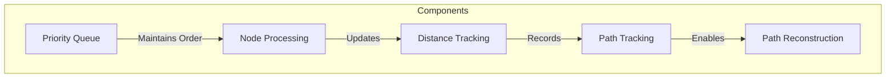

## 2. Implementation Structure

### Base Graph Structure
```java
public class WeightedGraph<T> {
    private Map<T, Map<T, Integer>> adjacencyList;
    
    public void addEdge(T source, T destination, int weight) {
        adjacencyList.computeIfAbsent(source, k -> new HashMap<>())
                    .put(destination, weight);
    }
}
```

### Priority Queue Management
```java
PriorityQueue<Node> pq = new PriorityQueue<>((a, b) -> 
    distances.get(a) - distances.get(b));
```

## 3. Algorithm Execution Process

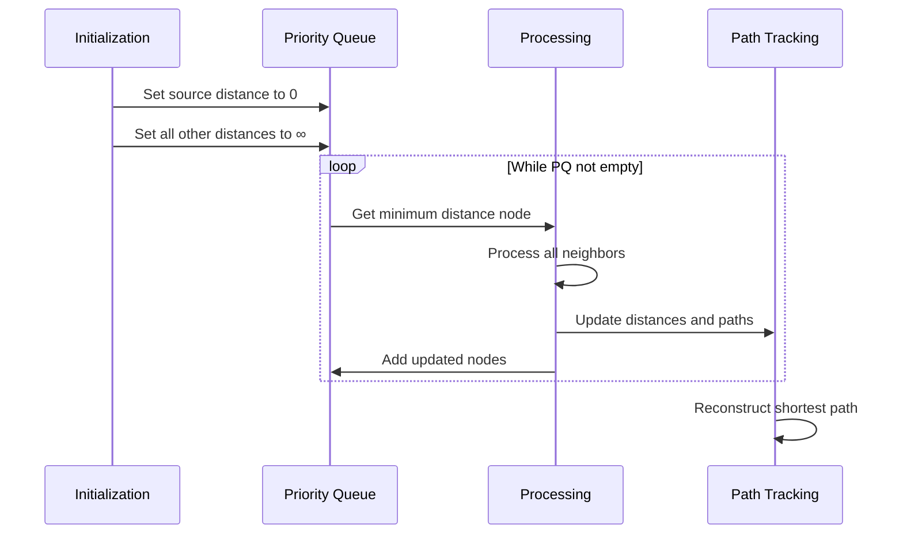

## 4. Example Walkthrough

### Sample Graph
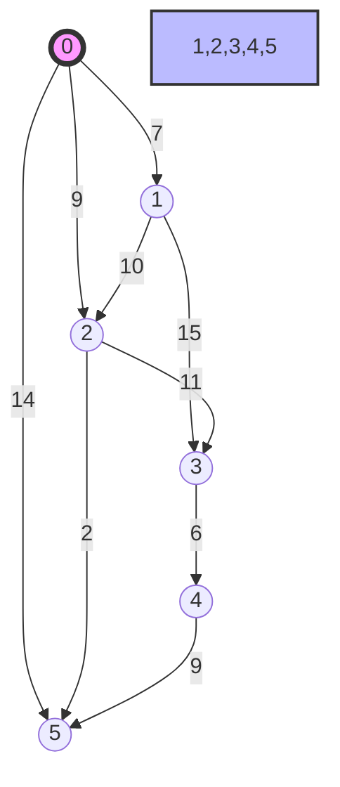

### Processing Steps
Initialize distances:

Node 0: 0

All other nodes: ∞

Priority Queue States:

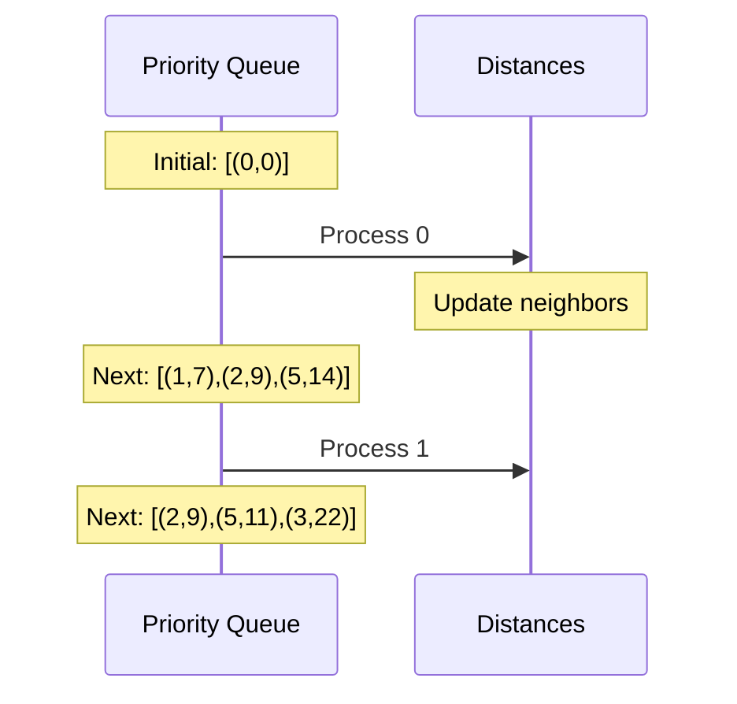

## 5. Path Reconstruction

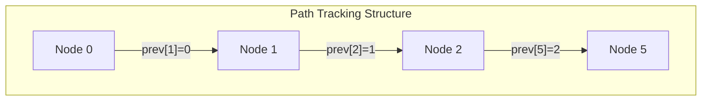

### Implementation:
```java
private List<Node> reconstructPath(Node destination) {
    List<Node> path = new ArrayList<>();
    Node current = destination;
    
    while (current != null) {
        path.add(0, current);
        current = previousNodes.get(current);
    }
    return path;
}
```

## 6. Edge Relaxation Process

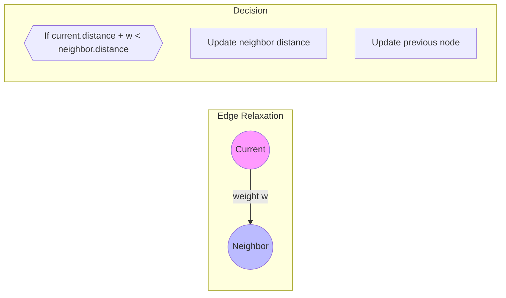

## 7. Performance Characteristics

### Time Complexity
With Binary Heap: O((V + E) log V)
With Fibonacci Heap: O(E + V log V)

### Space Complexity
Adjacency List: O(V + E)
Priority Queue: O(V)
Distance/Previous Arrays: O(V)

## 8. Optimization Techniques

### Priority Queue Optimization
```java
// Use offers instead of updates
if (newDistance < distances.get(neighbor)) {
    pq.offer(new Node(neighbor, newDistance));
    distances.put(neighbor, newDistance);
}
```

### Memory Management
```java
// Use primitive arrays for small graphs
int[] distances = new int[vertices];
int[] previous = new int[vertices];
```

### Early Termination
```java
if (current.equals(destination)) {
    break; // Found shortest path to destination
}
```

## 9. Best Practices

### Input Validation
```java
public void validateInput(Graph graph) {
    if (graph == null || graph.isEmpty()) {
        throw new IllegalArgumentException("Invalid graph");
    }
}
```

### Edge Case Handling
```java
if (source.equals(destination)) {
    return Collections.singletonList(source);
}
```

### Negative Weight Detection
```java
for (Edge edge : graph.getEdges()) {
    if (edge.weight < 0) {
        throw new IllegalArgumentException("Negative weights not supported");
    }
}
```

## 10. Common Applications
- Network Routing
- Social Networks
- Geographic Maps
- Game AI Pathfinding
- Resource Distribution

## 11. Testing Strategies
```java
@Test
public void testShortestPath() {
    WeightedGraph graph = new WeightedGraph();
    // Add test edges
    List<Node> path = dijkstra(graph, source, destination);
    assertNotNull(path);
    assertEquals(expectedDistance, getPathDistance(path));
}
```

Would you like me to expand on any particular section or add more specific implementation details?

## 1. Priority Queue Maintenance

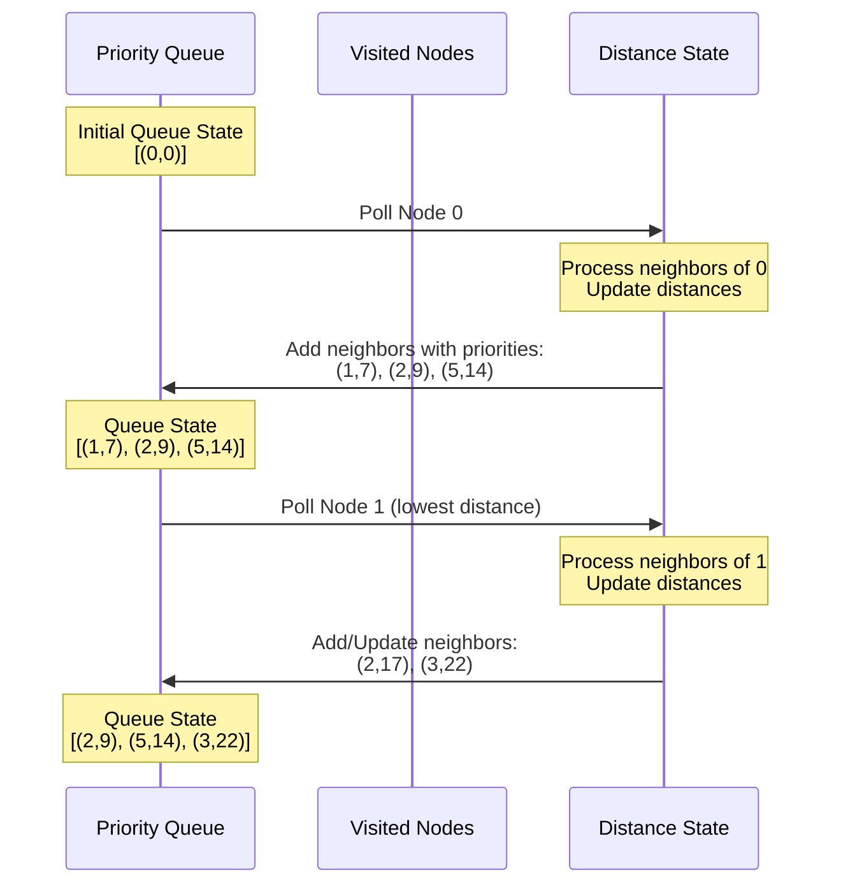

### Priority Queue Efficiency:
```java
// Binary Heap Implementation
PriorityQueue<Node> pq = new PriorityQueue<>((a, b) -> 
    distances.get(a) - distances.get(b));

// Key Operations:
// O(log n) insertion
pq.offer(new Node(vertex, distance));

// O(log n) removal of minimum element
Node current = pq.poll();

// O(1) peek at minimum element
Node next = pq.peek();
```

## 2. Path Reconstruction

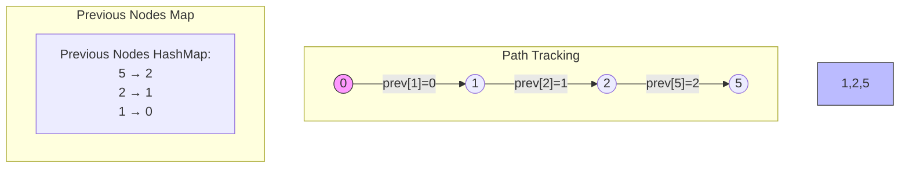

### Path Tracking Implementation:
```java
private Map<Node, Node> previousNodes = new HashMap<>();

private void trackPath(Node current, Node neighbor, int newDistance) {
    if (newDistance < distances.get(neighbor)) {
        distances.put(neighbor, newDistance);
        previousNodes.put(neighbor, current);  // Track the path
    }
}

private List<Node> reconstructPath(Node destination) {
    List<Node> path = new ArrayList<>();
    Node current = destination;
    
    while (current != null) {
        path.add(0, current);  // Add to front of list
        current = previousNodes.get(current);  // Move to previous node
    }
    return path;
}
```

## 3. Edge Relaxation

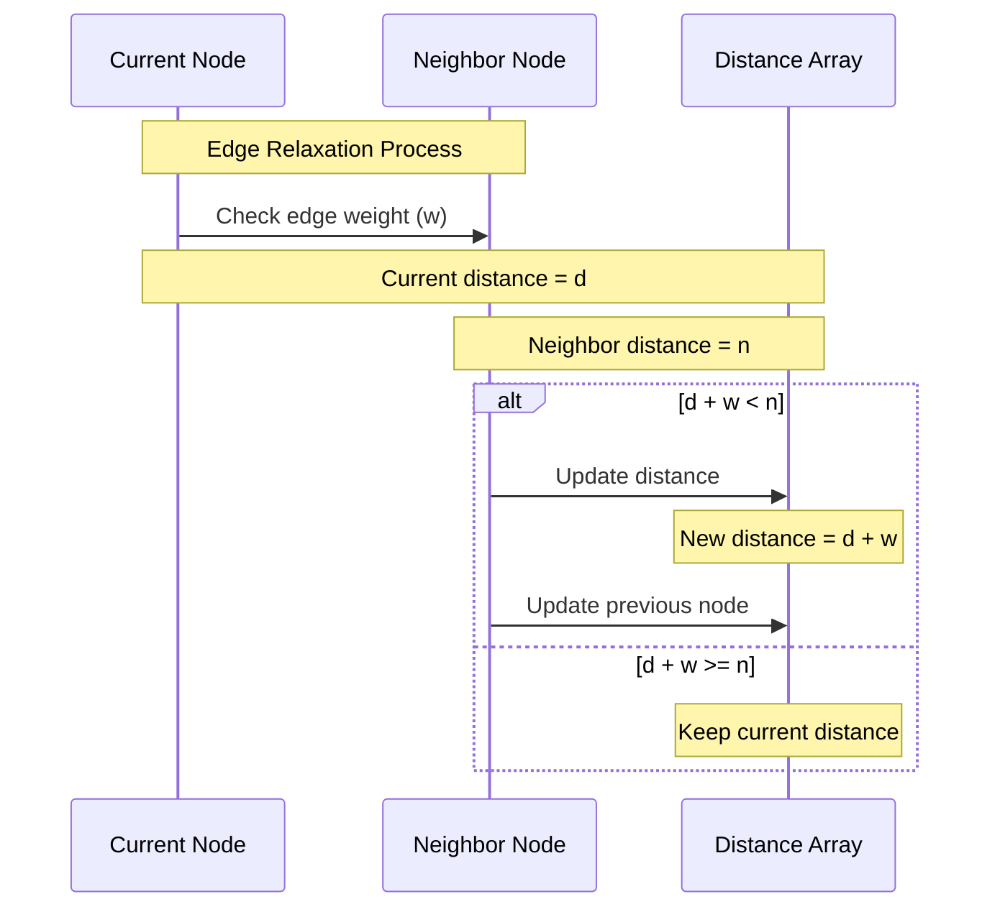

### Edge Relaxation Implementation:
```java
private void relaxEdge(Node current, Node neighbor, int weight) {
    int currentDistance = distances.get(current);
    int neighborDistance = distances.get(neighbor);
    int newDistance = currentDistance + weight;
    
    if (newDistance < neighborDistance) {
        // Update distance
        distances.put(neighbor, newDistance);
        // Update previous node
        previousNodes.put(neighbor, current);
        // Add to priority queue with new priority
        pq.offer(neighbor);
    }
}
```

## Combined Process Example

```mermaid
graph TD
    subgraph Processing State
        PQ[Priority Queue<br/>Current: (2,9)]
        DM[Distance Map<br/>0:0, 1:7, 2:9, 3:∞, 4:∞, 5:14]
        PM[Previous Map<br/>1←0, 2←0, 5←0]
    end
    
    subgraph Edge Relaxation
        direction LR
        C((Current: 2)) -->|"weight=2"| N((Neighbor: 5))
        Note["Old distance to 5: 14<br/>New possible distance: 11<br/>11 < 14, so update"]
    end
    
    subgraph Updated State
        PQ2[Priority Queue<br/>Next: (5,11)]
        DM2[Distance Map<br/>0:0, 1:7, 2:9, 3:∞, 4:∞, 5:11]
        PM2[Previous Map<br/>1←0, 2←0, 5←2]
    end
```

### Key Optimizations:
- Priority Queue Management
  - Maintain heap property after every update
  - Only add nodes when their distance improves
  - Use decrease-key operation when available

- Path Tracking
  - Only update previous node when finding shorter path
  - Store only essential path information
  - Reconstruct path only when needed

- Edge Relaxation
  - Process each edge at most once
  - Early termination when possible
  - Skip relaxation if current node's distance is infinity

## Comprehensive Guide to Dijkstra's Algorithm Implementation

### Overview
Dijkstra's Algorithm is a fundamental graph algorithm used to find the shortest paths between nodes in a weighted graph. This document provides a detailed exploration of its implementation, with a focus on a generic Java-based approach that supports multiple data types.

### Core Components

#### Graph Representation

1. Interface-based Design
The implementation uses a flexible interface-based approach:

```java
public interface Graph<T> {
    void addVertex(T vertex);
    void addEdge(T source, T destination, int weight);
    void addEdge(T source, T destination);
    Set<T> getNeighbors(T vertex);
    // ... other methods
}
```

2. Implementation Options

#### Adjacency List Implementation
```java
public class GraphList<T> implements Graph<T> {
    private final Map<T, Set<T>> adjacencyList;
    // Provides O(|V| + |E|) space complexity
    // Efficient for sparse graphs
}
```

#### Adjacency Matrix Implementation
```java
public class GraphMatrix<T extends Integer> implements Graph<T> {
    private final int[][] adjacencyMatrix;
    // Provides O(|V|²) space complexity
    // Efficient for dense graphs
}
```

#### Generic Node Structure
The implementation uses a generic node class to support various data types:

```java
public class GenericNode<T> {
    private T data;
    private List<GenericNode<T>> neighbors;
    private GenericNode<T> left;
    private GenericNode<T> right;
    
    // Constructor and methods
}
```

### Algorithm Implementation

#### Core Algorithm Structure
```java
public class DijkstraGeneric<T> {
    public Map<GenericNode<T>, Integer> findShortestPath(
            Map<GenericNode<T>, Map<GenericNode<T>, Integer>> graph,
            GenericNode<T> source,
            GenericNode<T> destination) {
        
        Map<GenericNode<T>, Integer> distances = new HashMap<>();
        Map<GenericNode<T>, GenericNode<T>> previousNodes = new HashMap<>();
        PriorityQueue<GenericNode<T>> queue = new PriorityQueue<>(
            (a, b) -> distances.getOrDefault(a, Integer.MAX_VALUE)
                    - distances.getOrDefault(b, Integer.MAX_VALUE)
        );
        
        // Initialize distances
        initializeDistances(graph, source, distances);
        
        // Process nodes
        processNodes(graph, distances, previousNodes, queue, destination);
        
        // Reconstruct path
        reconstructPath(previousNodes, destination);
        
        return distances;
    }
}
```

#### Key Components Breakdown

##### Initialization Phase
```java
private void initializeDistances(
        Map<GenericNode<T>, Map<GenericNode<T>, Integer>> graph,
        GenericNode<T> source,
        Map<GenericNode<T>, Integer> distances) {
    
    for (GenericNode<T> node : graph.keySet()) {
        distances.put(node, Integer.MAX_VALUE);
    }
    distances.put(source, 0);
}
```

##### Node Processing
```java
private void processNodes(
        Map<GenericNode<T>, Map<GenericNode<T>, Integer>> graph,
        Map<GenericNode<T>, Integer> distances,
        Map<GenericNode<T>, GenericNode<T>> previousNodes,
        PriorityQueue<GenericNode<T>> queue,
        GenericNode<T> destination) {
    
    while (!queue.isEmpty()) {
        GenericNode<T> current = queue.poll();
        if (current.equals(destination)) break;
        
        processNeighbors(current, graph, distances, previousNodes, queue);
    }
}
```

##### Path Reconstruction
```java
private void reconstructPath(
        Map<GenericNode<T>, GenericNode<T>> previousNodes,
        GenericNode<T> destination) {
    
    List<GenericNode<T>> path = new ArrayList<>();
    GenericNode<T> current = destination;
    
    while (current != null) {
        path.add(0, current);
        current = previousNodes.get(current);
    }
    
    printPath(path);
}
```

### Performance Characteristics

#### Time Complexity
With Binary Heap: O((|V| + |E|) log |V|)
With Fibonacci Heap: O(|E| + |V| log |V|)

#### Space Complexity
Adjacency List: O(|V| + |E|)
Adjacency Matrix: O(|V|²)

### Best Practices and Optimization Techniques

#### Priority Queue Optimization
- Use a binary heap for most cases
- Consider Fibonacci heap for very large graphs

#### Memory Management
- Use adjacency list for sparse graphs
- Use adjacency matrix for dense graphs

#### Edge Case Handling
- Validate input parameters
- Handle disconnected graphs
- Check for negative weights

### Common Pitfalls and Solutions

#### Negative Edge Weights
- Solution: Validate weights during edge addition
- Alternative: Use Bellman-Ford algorithm

#### Infinite Loops
- Solution: Track visited nodes
- Implement cycle detection

#### Memory Overflow
- Solution: Implement iterative deepening
- Use memory-efficient data structures

### Testing Strategies

#### Unit Tests
```java
@Test
public void testShortestPath() {
    GraphList<Integer> graph = new GraphList<>();
    // Add test edges
    assertEquals(expectedDistance, 
        algorithm.findShortestPath(graph, source, destination));
}
```

#### Edge Cases
- Empty graph
- Single node
- Disconnected components
- Maximum possible path length

### Conclusion
This implementation of Dijkstra's Algorithm provides a flexible, generic approach that can be adapted to various use cases while maintaining performance and reliability. The use of generics allows for versatile application across different data types, while the interface-based design ensures extensibility and maintainability.

## Comprehensive Guide to Dijkstra's Algorithm with Case Study 

### 1. Practical Example
Consider the following weighted graph:


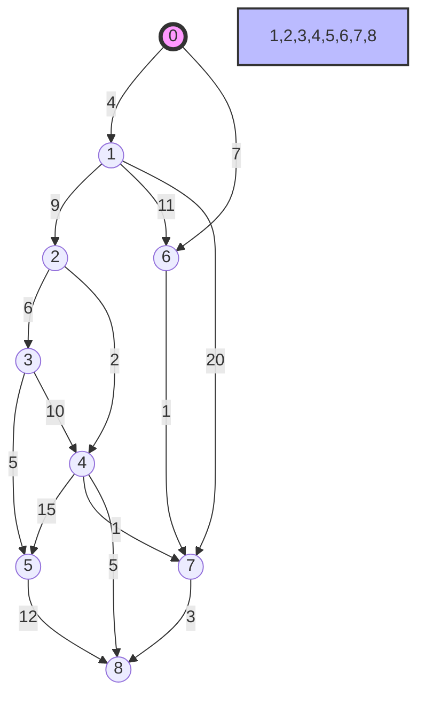

### Sample Path Analysis: 0 to 8
Let's trace how Dijkstra's algorithm finds the shortest path from node 0 to node 8.

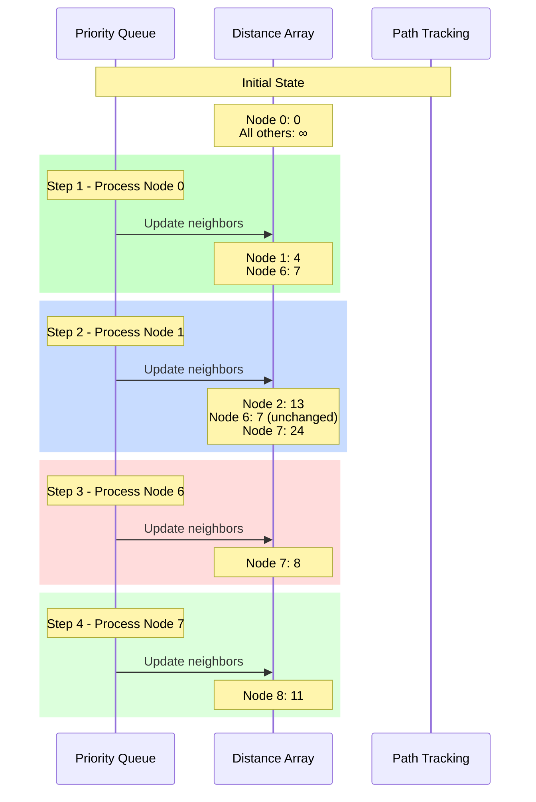

### Shortest Path Discovery
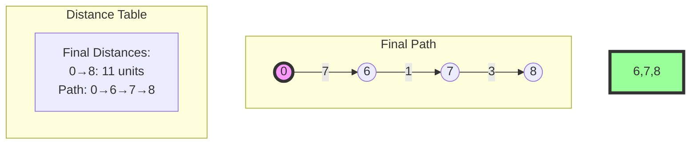

### 2. Algorithm Implementation for Example
```java
public class DijkstraExample {
    public static Map<Integer, Integer> findShortestPath(WeightedGraph graph, int start) {
        Map<Integer, Integer> distances = new HashMap<>();
        PriorityQueue<Node> pq = new PriorityQueue<>(
            (a, b) -> distances.get(a) - distances.get(b)
        );
        
        // Initialize distances
        for (int node = 0; node < 9; node++) {
            distances.put(node, Integer.MAX_VALUE);
        }
        distances.put(start, 0);
        pq.offer(new Node(start));
        while (!pq.isEmpty()) {
            Node current = pq.poll();
            
            for (Edge edge : graph.getEdges(current.id)) {
                int newDist = distances.get(current.id) + edge.weight;
                if (newDist < distances.get(edge.dest)) {
                    distances.put(edge.dest, newDist);
                    pq.offer(new Node(edge.dest));
                }
            }
        }
        return distances;
    }
}
```

### 3. Step-by-Step Path Discovery
Key Decision Points in Example Graph:
Initial Choice at Node 0:

Option 1: 0→1 (weight: 4)
Option 2: 0→6 (weight: 7) ✓

From Node 6:

Direct path to 7 (weight: 1) ✓

From Node 7:

Direct path to 8 (weight: 3) ✓

### Alternative Paths Analysis:
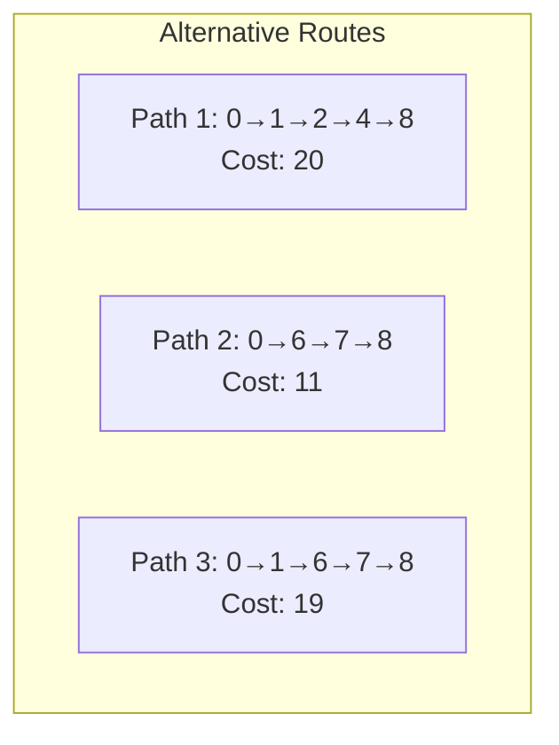

### 4. Implementation Details

#### Priority Queue State Transitions
```java
// Example progression of priority queue states
Step 1: [(0,0)]
Step 2: [(1,4), (6,7)]
Step 3: [(6,7), (2,13), (7,24)]
Step 4: [(7,8), (2,13)]
Step 5: [(8,11), (2,13)]
```

#### Path Tracking
```java
Map<Integer, Integer> previousNodes = new HashMap<>();
// After algorithm completion:
// 8 → 7 → 6 → 0
```

This practical example demonstrates how Dijkstra's algorithm:
- Always selects the minimum current distance node
- Updates distances through edge relaxation
- Maintains an optimal substructure
- Guarantees the shortest path upon completion

## Dijkstra's Algorithm: Comparative Analysis

### Graph Structures

#### Example 1 (Original Graph)


#### Example 2 (Extended Graph)


### Algorithm Processing Steps
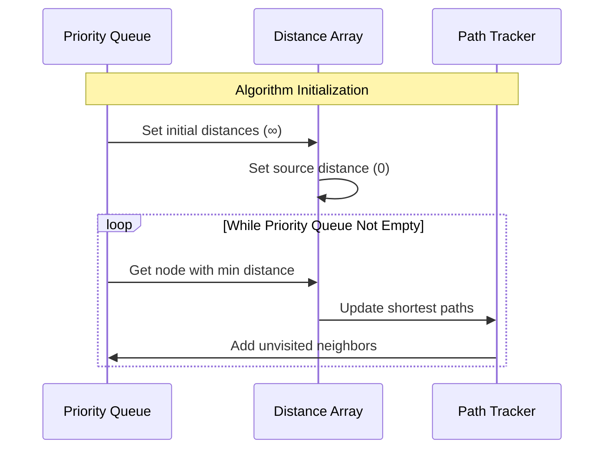

### Detailed Analysis for Example 1 (0 to 5)
```mermaid
sequenceDiagram
    participant Start as Start(0)
    participant Process as Processing
    participant End as End(5)
    
    Note over Start: Initial state
    Start->>Process: Distance[0] = 0
    Note over Process: Visit node 0
    Process->>Process: Update neighbors
    Note right of Process: 1: min(∞, 7) = 7
    Note right of Process: 2: min(∞, 9) = 9
    Note right of Process: 5: min(∞, 14) = 14
    
    Process->>Process: Visit node 1
    Note right of Process: 2: min(9, 7+10) = 9
    Note right of Process: 3: min(∞, 7+15) = 22
    
    Process->>Process: Visit node 2
    Note right of Process: 5: min(14, 9+2) = 11
    
    Process->>End: Final shortest path
    Note over End: Distance[5] = 11
```

### Detailed Analysis for Example 2 (0 to 8)
```mermaid
sequenceDiagram
    participant Start as Start(0)
    participant Process as Processing
    participant End as End(8)
    
    Note over Start: Initial state
    Start->>Process: Distance[0] = 0
    Note over Process: Visit node 0
    Process->>Process: Update neighbors
    Note right of Process: 1: min(∞, 4) = 4
    Note right of Process: 6: min(∞, 7) = 7
    
    Process->>Process: Visit node 1
    Note right of Process: 2: min(∞, 4+9) = 13
    Note right of Process: 6: min(7, 4+11) = 7
    Note right of Process: 7: min(∞, 4+20) = 24
    
    Process->>Process: Visit node 6
    Note right of Process: 7: min(24, 7+1) = 8
    
    Process->>Process: Visit node 7
    Note right of Process: 8: min(∞, 8+3) = 11
    
    Process->>End: Final shortest path
    Note over End: Distance[8] = 11
```

### Key Findings
Example 1 (0 to 5):
- Shortest path: 0 → 2 → 5
- Total distance: 11 units
- Key decision point: Choosing path through node 2 instead of direct path (14)

Example 2 (0 to 8):
- Shortest path: 0 → 6 → 7 → 8
- Total distance: 11 units
- Key decision point: Using path through nodes 6 and 7 instead of longer alternatives

### Implementation Considerations
- Priority Queue maintenance is crucial for efficiency
- Path reconstruction requires tracking previous nodes
- Edge relaxation determines optimal path selection
- Time complexity: O((V + E) log V) with binary heap
- Space complexity: O(V + E) with adjacency list

Would you like me to elaborate on any specific part of this analysis or focus on a particular path finding scenario in either graph?

Let's significantly expand the provided text on Dijkstra's Algorithm, delving deeper into its intricacies, optimizations, and applications.

## Comprehensive Guide to Dijkstra's Algorithm: Theory, Implementation, and Applications
The main idea behind Dijkstra's Algorithm is to efficiently find the shortest path between a starting node (source node) and every other node in a graph with non-negative edge weights.

It achieves this by using a greedy approach:
- Maintaining a priority queue: The algorithm keeps track of the "most promising" nodes to explore next. These are the nodes that currently have the smallest estimated distance from the source.
- Iterative exploration:  It repeatedly selects the node with the smallest estimated distance from the priority queue.
- Updating distances:  The algorithm then explores the neighbors of this node. If it finds a shorter path to a neighbor through the current node, it updates the neighbor's estimated distance.
- Expanding the explored set: The processed node is marked as "explored," and the process continues until all reachable nodes have been explored.

### Key Principle: 
The algorithm leverages the property that the shortest path to any explored node is known. This allows it to build upon previously discovered shortest paths to find the optimal routes to all other nodes.

In essence, Dijkstra's Algorithm is a systematic way of exploring a graph, always prioritizing the nodes closest to the source and updating distances as shorter paths are discovered. This leads to the discovery of the shortest paths to all reachable nodes in the graph.

### Introduction

Dijkstra's Algorithm, conceived by Edsger Dijkstra in 1956, stands as a cornerstone in graph theory and computer science. Its primary function is to determine the shortest path between a starting node (source) and every other node in a graph. The algorithm's elegance lies in its ability to efficiently solve this problem for graphs with non-negative edge weights. This comprehensive guide will explore the algorithm's theoretical underpinnings, practical implementation strategies, optimization techniques, and real-world applications.

## 1. Theoretical Foundations

### 1.1. The Shortest Path Problem

The shortest path problem seeks the path with the minimum cumulative weight between two nodes in a graph. This problem finds applications in various domains, including:
- Network Routing: Finding the fastest route for data packets in a computer network.
- Transportation: Determining the optimal route for vehicles or goods, considering factors like distance, traffic, and tolls.
- Robotics: Planning the most efficient path for a robot to navigate in a given environment, avoiding obstacles and minimizing energy consumption.
- Geographic Information Systems (GIS): Calculating the shortest distance or travel time between locations on a map, considering road networks, terrain, and traffic conditions.
- Logistics and Supply Chain Management: Optimizing the delivery of goods and services by finding the most efficient routes and schedules.
- Financial Networks: Analyzing the flow of funds and identifying critical paths in financial systems.

### 1.2. Dijkstra's Algorithm: The Greedy Approach

Dijkstra's Algorithm employs a greedy strategy to solve the shortest path problem. The algorithm maintains a set of explored nodes (whose shortest distances from the source are known) and a priority queue of unexplored nodes. In each iteration, the algorithm:
- Selects the node with the minimum tentative distance from the source from the priority queue.
- Explores its neighbors and updates their tentative distances if a shorter path is discovered.
- Adds the explored node to the set of explored nodes.

This process continues until all nodes are explored or the destination node is reached. The greedy nature of the algorithm ensures that it always selects the most promising node for exploration, leading to an optimal solution.

### 1.3. Correctness and Optimality

Dijkstra's Algorithm's correctness and optimality rely on the following properties:
- Non-Negative Weights: The algorithm assumes that all edge weights are non-negative. This ensures that the shortest path to a node is always found before exploring nodes with potentially longer paths. If negative weights are present, alternative algorithms like the Bellman-Ford algorithm must be used.
- Optimal Substructure: The shortest path to any node in the graph can be decomposed into a series of shortest paths to its intermediate nodes. This property allows the algorithm to build upon previously discovered shortest paths.
- Greedy Choice Property: At each step, the algorithm selects the node with the minimum tentative distance, which is guaranteed to be part of the shortest path. This greedy choice leads to an optimal solution.

## 2. Implementation Strategies

### 2.1. Graph Representation

The choice of graph representation significantly impacts the algorithm's efficiency. Two common representations are:
- Adjacency List: Stores the graph as a collection of lists, where each list represents a node and its adjacent edges (with corresponding weights). This representation is memory-efficient for sparse graphs (graphs with relatively few edges).
- Adjacency Matrix: Stores the graph as a two-dimensional matrix, where each cell represents the weight of the edge between two nodes. This representation is faster for dense graphs (graphs with many edges) but consumes more memory.

The choice between these representations depends on the specific characteristics of the graph being analyzed.

### 2.2. Priority Queue

The priority queue is a critical component of Dijkstra's Algorithm, as it efficiently retrieves the node with the minimum tentative distance. Several data structures can be used to implement the priority queue:
- Binary Heap: Offers a good balance between insertion, deletion, and retrieval operations (all with logarithmic time complexity). This is a common choice for most implementations.
- Fibonacci Heap: Provides better theoretical time complexity for certain operations (amortized constant time for decrease-key), but can be more complex to implement and may have higher constant factors.
- Pairing Heap: Offers similar performance to Fibonacci heaps with potentially simpler implementation, making it a good alternative in practice.

The selection of the priority queue data structure can affect the algorithm's overall performance, especially for large graphs.

### 2.3. Distance and Path Tracking

The algorithm maintains two data structures to track the progress:
- Distance Array: Stores the tentative shortest distances from the source to each node.
- Previous Node Array: Stores the previous node on the shortest path to each node, enabling path reconstruction.

## 3. Algorithm Execution

### Initialization:
- Set the tentative distance of the source node to 0.
- Set the tentative distances of all other nodes to infinity.
- Add the source node to the priority queue.

### Iteration:
- While the priority queue is not empty:
  - Extract the node with the minimum tentative distance from the priority queue.
  - Mark the node as explored.
  - For each neighbor of the current node:
    - Calculate a new tentative distance through the current node.
    - If the new distance is shorter than the current tentative distance of the neighbor:
      - Update the neighbor's tentative distance.
      - Update the neighbor's previous node to the current node.
      - Add or update the neighbor in the priority queue.

### Path Reconstruction:
- Start from the destination node.
- Use the previous node array to trace back the shortest path to the source node.

## 4. Optimization Techniques

### Priority Queue Optimization:
- Use a suitable data structure based on graph characteristics.
- Minimize unnecessary updates to the priority queue.

### Memory Management:
- Choose an appropriate graph representation.
- Consider memory-efficient data structures for large graphs.

### Early Termination:
- Stop the algorithm when the destination node is reached.
- Use heuristics to prune unpromising paths.

## 5. Performance Analysis

### Time Complexity:
- Depends on the priority queue implementation.
- O((|V| + |E|) log |V|) with a binary heap.
- O(|E| + |V| log |V|) with a Fibonacci heap.

### Space Complexity:
- Depends on the graph representation.
- O(|V| + |E|) with an adjacency list.
- O(|V|^2) with an adjacency matrix.

## 6. Applications
- Network Routing: Finding the fastest and most reliable routes for data packets.
- Transportation: Optimizing routes for vehicles, considering distance, traffic, and costs.
- Robotics: Planning efficient paths for robots in various environments.
- Geographic Information Systems (GIS): Calculating shortest distances and routes on maps.
- Logistics and Supply Chain Management: Optimizing the delivery of goods and services.

## 7. Case Study: Network Routing
- Scenario: A network with routers and links, each link having a cost (representing delay or bandwidth).
- Objective: Find the shortest path between two routers.
- Solution: Apply Dijkstra's Algorithm using the routers as nodes and the links as edges with their associated costs.

## 8. Conclusion
Dijkstra's Algorithm is a powerful tool. 
The document could be significantly improved by incorporating more diverse and detailed examples of how to use Dijkstra's algorithm. While it currently provides a solid theoretical foundation and implementation guidance, the practical application aspect could be strengthened. Here are some ways to enhance the document with more examples:

### Illustrative Use Cases:
- Beyond Network Routing: The document focuses heavily on network routing as an application. Expanding to other domains like transportation, robotics, and GIS with concrete scenarios would showcase the algorithm's versatility.
- Step-by-Step Walkthroughs: Detailed, step-by-step examples of applying Dijkstra's algorithm to specific graph problems would aid understanding. This could include visualizing the graph, the priority queue states, and the path reconstruction process.
- Code Examples: Providing code snippets in popular programming languages (Java, Python, C++) demonstrating the algorithm's implementation for different use cases would be valuable for practical learners.

### Varying Graph Types:
- Sparse vs. Dense Graphs: Showcasing how the choice of graph representation (adjacency list vs. matrix) impacts performance for different graph densities would provide practical insights.
- Directed vs. Undirected Graphs: Illustrating how the algorithm adapts to both directed and undirected graphs would highlight its flexibility.
- Graphs with Varying Edge Weights: Using examples with different weight distributions (uniform, random, skewed) would demonstrate the algorithm's robustness.

### Problem-Solving Scenarios:
- Real-World Problems: Presenting real-world scenarios (e.g., finding the shortest driving route, optimizing robot navigation) and applying Dijkstra's algorithm to solve them would bridge the gap between theory and practice.
- Comparison with Other Algorithms: Comparing the performance of Dijkstra's algorithm with other shortest path algorithms (e.g., Bellman-Ford, A*) for specific scenarios would provide a deeper understanding of its strengths and limitations.

By incorporating these types of examples, the document would become a more comprehensive and practical resource for understanding and applying Dijkstra's algorithm in various domains. It would empower readers to effectively utilize the algorithm to solve real-world problems and make informed decisions about implementation choices.
