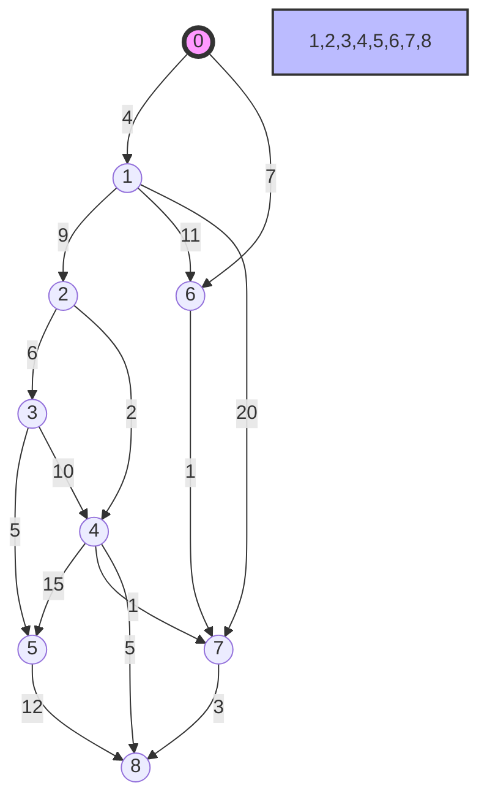
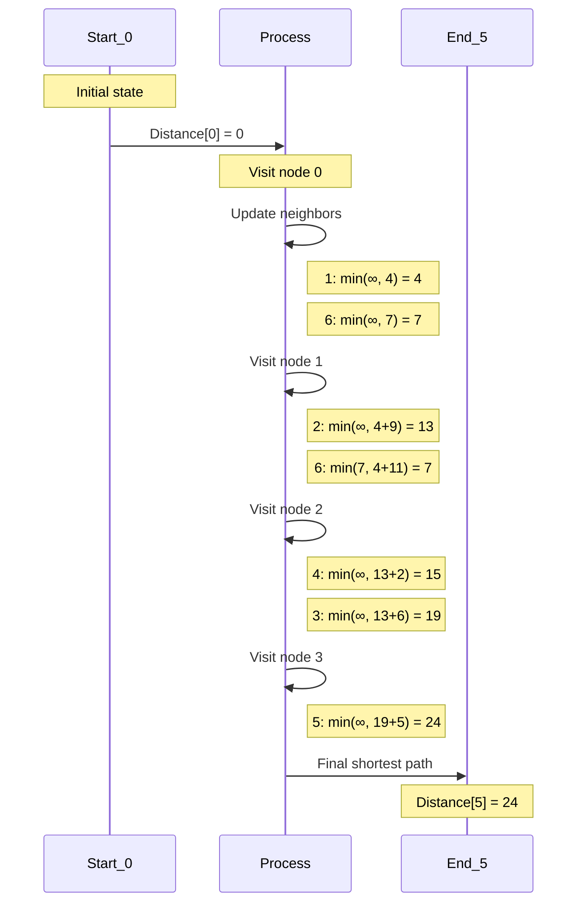
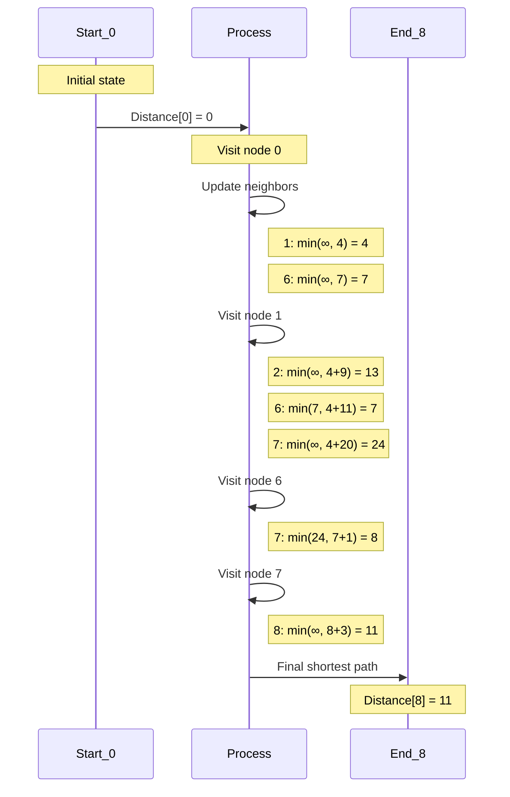

## Comprehensive Guide to Dijkstra's Algorithm with Presentation Example 

### 1. Presentation Example
Consider the following weighted graph:

## Dijkstra's Algorithm: Comparative Analysis

### Graph Structure Characteristics

| Characteristic | Graph Details |
|---------------|---------------|
| Number of Nodes | 9 (0-8) |
| Connectivity | Highly Connected |
| Longest Possible Path | 0 → 1 → 7 → 8 |
| Maximum Edge Weight | 20 |

### Detailed Analysis for Shortest Path (0 to 5)

### Key Findings for Shortest Path (0 to 5)
- Shortest path: 0 → 1 → 2 → 3 → 5
- Total distance: 24 units
- Key decision points: 
  1. Initial route through node 1
  2. Navigating through intermediate nodes 2 and 3
  3. Balancing edge weights to find optimal path

### Calculation Breakdown
- 0 → 1: 4 units
- 1 → 2: 9 units
- 2 → 3: 6 units
- 3 → 5: 5 units
- Total distance: 4 + 9 + 6 + 5 = 24 units

### Detailed Analysis for Shortest Path (0 to 8)

### Key Findings for Shortest Path (0 to 8)
- Shortest path: 0 → 6 → 7 → 8
- Total distance: 11 units
- Key decision point: Using path through nodes 6 and 7 instead of longer alternatives

