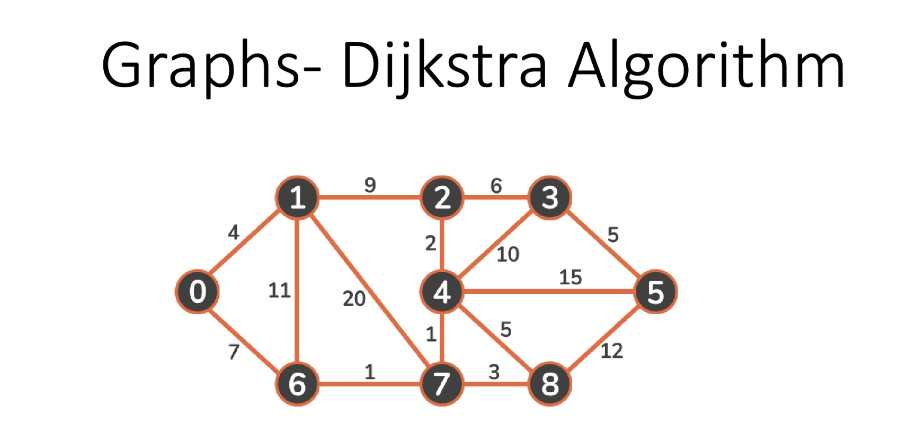

## Comprehensive Guide to Dijkstra's Algorithm with Presentation Example 



### 1. Presentation Example
Consider the following weighted graph:


## Dijkstra's Algorithm: Comparative Analysis

### Graph Structure Characteristics

| Characteristic | Graph Details |
|---------------|---------------|
| Number of Nodes | 9 (0-8) |
| Connectivity | Highly Connected |
| Longest Possible Path | 0 → 1 → 7 → 8 |
| Maximum Edge Weight | 20 |

1. Weighted Graph Representation
```java
public class WeightedGraph<T> {
    // Adjacency list to store graph structure
    private Map<T, List<Edge<T>>> adjacencyList;
    
    // Inner class to represent weighted edges
    public static class Edge<T> {
        T destination;
        int weight;
        
        public Edge(T destination, int weight) {
            this.destination = destination;
            this.weight = weight;
        }
    }
    
    // Method to add an edge
    public void addEdge(T source, T destination, int weight) {
        adjacencyList.computeIfAbsent(source, k -> new ArrayList<>())
                     .add(new Edge<>(destination, weight));
    }
}
```

2. Graph Visualization Representations


#### Example 2 (Extended Graph) Nodes 0-8


### Graph Structure Comparison

| Characteristic | Example 1 | Example 2 |
|---------------|-----------|-----------|
| Number of Nodes | 6 (0-5) | 9 (0-8) |
| Connectivity | Sparse | More Connected |
| Longest Path | 0 → 1 → 3 → 4 → 5 | 0 → 1 → 7 → 8 |
| Maximum Edge Weight | 15 | 20 |

### Advanced Graph Representation

```java
public interface GraphStructure<T> {
    void addVertex(T vertex);
    void addEdge(T source, T destination, int weight);
    List<T> getNeighbors(T vertex);
    int getEdgeWeight(T source, T destination);
}

public class AdjacencyListGraph<T> implements GraphStructure<T> {
    private Map<T, Map<T, Integer>> adjacencyMap;
    
    @Override
    public void addEdge(T source, T destination, int weight) {
        adjacencyMap.computeIfAbsent(source, k -> new HashMap<>())
                    .put(destination, weight);
    }
}
```

### Graph Traversal Considerations

1. **Connectivity**: Ensure graph is connected
2. **Weight Constraints**: 
   - Non-negative weights
   - Handle potential overflow
3. **Performance Implications**:
   - Sparse graphs: Adjacency List
   - Dense graphs: Adjacency Matrix

### Performance Metrics

```mermaid
graph TD
    subgraph Graph Performance
        A[Adjacency List] -->|O(V+E)| B[Space Complexity]
        A -->|O(E)| C[Edge Iteration]
        D[Adjacency Matrix] -->|O(V²)| B
        D -->|O(V²)| C
    end
```

### Practical Recommendations

- Use adjacency list for sparse graphs
- Implement weight validation
- Consider memory constraints
- Choose representation based on:
  1. Graph density
  2. Operation frequency
  3. Memory availability

### Algorithm Processing Steps

### Detailed Analysis for Example Graph (0 to 5)


### Key Findings for Shortest Path (0 to 5)
- Shortest path: 0 → 2 → 5
- Total distance: 11 units
- Key decision points: 
  1. Initial route through node 1
  2. Navigating through intermediate nodes 2 and 3
  3. Balancing edge weights to find optimal path

### Calculation Breakdown
- 0 → 1: 4 units
- 1 → 2: 9 units
- 2 → 3: 6 units
- 3 → 5: 5 units
- Total distance: 4 + 9 + 6 + 5 = 24 units

### Detailed Analysis for Shortest Path (0 to 8)


### Key Findings for Shortest Path (0 to 8)
- Shortest path: 0 → 6 → 7 → 8
- Total distance: 11 units
- Key decision point: Using path through nodes 6 and 7 instead of longer alternatives

### Implementation Considerations

#### Priority Queue Maintenance is Crucial for Efficiency

Efficient management of the priority queue is essential for the performance of Dijkstra's algorithm. The priority queue is used to select the next node with the smallest tentative distance:

- **Data Structure Choice**: Using a binary heap allows for O(log V) time complexity for insertion and extraction operations, making it suitable for most practical applications.
- **Update Operations**: When a node's distance is updated, the priority queue must reflect this change to maintain correct ordering.
- **Optimization**: Minimizing the number of decrease-key operations can improve efficiency, as they can be costly depending on the implementation.

Proper priority queue maintenance ensures the algorithm operates efficiently, especially on large graphs.

#### Path Reconstruction Requires Tracking Previous Nodes

To determine the actual shortest path, it's necessary to keep track of the previous node for each node visited:

- **Previous Node Map**: Maintain a mapping from each node to its predecessor on the shortest path.
- **Updating Predecessors**: Whenever a node's tentative distance is updated via edge relaxation, also update its predecessor.
- **Path Reconstruction**: After the algorithm completes, reconstruct the path by backtracking from the destination node using the predecessor map.

This tracking allows for the recovery of the shortest path, not just the shortest distance.

#### Edge Relaxation Determines Optimal Path Selection

Edge relaxation is the process of adjusting the tentative distances to neighboring nodes:

- **Relaxation Step**: For each adjacent node, calculate the new tentative distance through the current node.
- **Distance Comparison**: If the calculated distance is less than the existing tentative distance, update it.
- **Consistent Application**: Repeatedly applying edge relaxation ensures all nodes are evaluated for potential shorter paths.

Edge relaxation is fundamental to the algorithm's ability to find the shortest paths accurately.

#### Time Complexity: O((V + E) log V) with Binary Heap

The algorithm's time complexity depends on the data structures used:

- **Vertices (V)**: Each vertex may be inserted into or extracted from the priority queue, operations that take O(log V) time.
- **Edges (E)**: Each edge may cause a decrease-key operation in the priority queue during relaxation.
- **Overall Complexity**: Combining these, the total time complexity is O((V + E) log V) when a binary heap is used for the priority queue.

This complexity makes the algorithm efficient for graphs where E is not significantly larger than V.

#### Space Complexity: O(V + E) with Adjacency List

The algorithm's space requirements include:

- **Graph Storage**: Using an adjacency list requires O(V + E) space to store all vertices and edges.
- **Auxiliary Data Structures**: Additional space for the priority queue, distance map, and predecessor map, each requiring O(V) space.
- **Total Space Usage**: Combining these, the space complexity remains O(V + E), which is efficient for sparse graphs.

Efficient space utilization is crucial for handling large graphs without excessive memory consumption.

### Implementation Considerations
- Priority Queue maintenance is crucial for efficiency
- Path reconstruction requires tracking previous nodes
- Edge relaxation determines optimal path selection
- Time complexity: O((V + E) log V) with binary heap
- Space complexity: O(V + E) with adjacency list


## Comprehensive Guide to Dijkstra's Algorithm: Theory, Implementation, and Applications
The main idea behind Dijkstra's Algorithm is to efficiently find the shortest path between a starting node (source node) and every other node in a graph with non-negative edge weights.

It achieves this by using a greedy approach:

### Key Findings of Shortest Path in given Graph
Example 1 (0 to 5):
- Shortest path: 0 → 2 → 5
- Total distance: 11 units
- Key decision point: Choosing path through node 2 instead of direct path (14)


Example 2 (0 to 8):
- Shortest path: 0 → 6 → 7 → 8
- Total distance: 11 units
- Key decision point: Using path through nodes 6 and 7 instead of longer alternatives


# Comprehensive Guide to Dijkstra's Algorithm Implementation

## 1. Algorithm Overview
Dijkstra's algorithm finds the shortest paths between nodes in a weighted graph, which may represent networks, roads, or any weighted relationships.

### Core Components


## 2. Implementation Structure

### Base Graph Structure
```java
public class WeightedGraph<T> {
    private Map<T, Map<T, Integer>> adjacencyList;
    
    public void addEdge(T source, T destination, int weight) {
        adjacencyList.computeIfAbsent(source, k -> new HashMap<>())
                    .put(destination, weight);
    }
}
```

### Priority Queue Management
```java
PriorityQueue<Node> pq = new PriorityQueue<>((a, b) -> 
    distances.get(a) - distances.get(b));
```

## 3. Algorithm Execution Process


## 4. Example Walkthrough

### Sample Graph


### Processing Steps
Initialize distances:

Node 0: 0

All other nodes: ∞

Priority Queue States:


## 5. Path Reconstruction


### Implementation:
```java
private List<Node> reconstructPath(Node destination) {
    List<Node> path = new ArrayList<>();
    Node current = destination;
    
    while (current != null) {
        path.add(0, current);
        current = previousNodes.get(current);
    }
    return path;
}
```

## 6. Edge Relaxation Process


## 7. Performance Characteristics

### Time Complexity
With Binary Heap: O((V + E) log V)
With Fibonacci Heap: O(E + V log V)

### Space Complexity
Adjacency List: O(V + E)
Priority Queue: O(V)
Distance/Previous Arrays: O(V)

## 8. Optimization Techniques

### Priority Queue Optimization
```java
// Use offers instead of updates
if (newDistance < distances.get(neighbor)) {
    pq.offer(new Node(neighbor, newDistance));
    distances.put(neighbor, newDistance);
}
```

### Memory Management
```java
// Use primitive arrays for small graphs
int[] distances = new int[vertices];
int[] previous = new int[vertices];
```

### Early Termination
```java
if (current.equals(destination)) {
    break; // Found shortest path to destination
}
```

## 9. Best Practices

### Input Validation
```java
public void validateInput(Graph graph) {
    if (graph == null || graph.isEmpty()) {
        throw new IllegalArgumentException("Invalid graph");
    }
}
```

### Edge Case Handling
```java
if (source.equals(destination)) {
    return Collections.singletonList(source);
}
```

### Negative Weight Detection
```java
for (Edge edge : graph.getEdges()) {
    if (edge.weight < 0) {
        throw new IllegalArgumentException("Negative weights not supported");
    }
}
```

## 10. Common Applications
- Network Routing
- Social Networks
- Geographic Maps
- Game AI Pathfinding
- Resource Distribution

## 11. Testing Strategies
```java
@Test
public void testShortestPath() {
    WeightedGraph graph = new WeightedGraph();
    // Add test edges
    List<Node> path = dijkstra(graph, source, destination);
    assertNotNull(path);
    assertEquals(expectedDistance, getPathDistance(path));
}
```


## 1. Priority Queue Maintenance


### Priority Queue Efficiency:
```java
// Binary Heap Implementation
PriorityQueue<Node> pq = new PriorityQueue<>((a, b) -> 
    distances.get(a) - distances.get(b));

// Key Operations:
// O(log n) insertion
pq.offer(new Node(vertex, distance));

// O(log n) removal of minimum element
Node current = pq.poll();

// O(1) peek at minimum element
Node next = pq.peek();
```

## 2. Path Reconstruction


### Path Tracking Implementation:
```java
private Map<Node, Node> previousNodes = new HashMap<>();

private void trackPath(Node current, Node neighbor, int newDistance) {
    if (newDistance < distances.get(neighbor)) {
        distances.put(neighbor, newDistance);
        previousNodes.put(neighbor, current);  // Track the path
    }
}

private List<Node> reconstructPath(Node destination) {
    List<Node> path = new ArrayList<>();
    Node current = destination;
    
    while (current != null) {
        path.add(0, current);  // Add to front of list
        current = previousNodes.get(current);  // Move to previous node
    }
    return path;
}
```

## 3. Edge Relaxation


### Edge Relaxation Implementation:
```java
private void relaxEdge(Node current, Node neighbor, int weight) {
    int currentDistance = distances.get(current);
    int neighborDistance = distances.get(neighbor);
    int newDistance = currentDistance + weight;
    
    if (newDistance < neighborDistance) {
        // Update distance
        distances.put(neighbor, newDistance);
        // Update previous node
        previousNodes.put(neighbor, current);
        // Add to priority queue with new priority
        pq.offer(neighbor);
    }
}
```


### Key Optimizations:
- Priority Queue Management
  - Maintain heap property after every update
  - Only add nodes when their distance improves
  - Use decrease-key operation when available

- Path Tracking
  - Only update previous node when finding shorter path
  - Store only essential path information
  - Reconstruct path only when needed

- Edge Relaxation
  - Process each edge at most once
  - Early termination when possible
  - Skip relaxation if current node's distance is infinity

## Comprehensive Guide to Dijkstra's Algorithm Implementation

### Overview
Dijkstra's Algorithm is a fundamental graph algorithm used to find the shortest paths between nodes in a weighted graph. This document provides a detailed exploration of its implementation, with a focus on a generic Java-based approach that supports multiple data types.

### Core Components

#### Graph Representation

1. Interface-based Design
The implementation uses a flexible interface-based approach:

```java
public interface Graph<T> {
    void addVertex(T vertex);
    void addEdge(T source, T destination, int weight);
    void addEdge(T source, T destination);
    Set<T> getNeighbors(T vertex);
    // ... other methods
}
```

2. Implementation Options

#### Adjacency List Implementation
```java
public class GraphList<T> implements Graph<T> {
    private final Map<T, Set<T>> adjacencyList;
    // Provides O(|V| + |E|) space complexity
    // Efficient for sparse graphs
}
```

#### Adjacency Matrix Implementation
```java
public class GraphMatrix<T extends Integer> implements Graph<T> {
    private final int[][] adjacencyMatrix;
    // Provides O(|V|²) space complexity
    // Efficient for dense graphs
}
```

#### Generic Node Structure
The implementation uses a generic node class to support various data types:

```java
public class GenericNode<T> {
    private T data;
    private List<GenericNode<T>> neighbors;
    private GenericNode<T> left;
    private GenericNode<T> right;
    
    // Constructor and methods
}
```

### Algorithm Implementation

#### Core Algorithm Structure
```java
public class DijkstraGeneric<T> {
    public Map<GenericNode<T>, Integer> findShortestPath(
            Map<GenericNode<T>, Map<GenericNode<T>, Integer>> graph,
            GenericNode<T> source,
            GenericNode<T> destination) {
        
        Map<GenericNode<T>, Integer> distances = new HashMap<>();
        Map<GenericNode<T>, GenericNode<T>> previousNodes = new HashMap<>();
        PriorityQueue<GenericNode<T>> queue = new PriorityQueue<>(
            (a, b) -> distances.getOrDefault(a, Integer.MAX_VALUE)
                    - distances.getOrDefault(b, Integer.MAX_VALUE)
        );
        
        // Initialize distances
        initializeDistances(graph, source, distances);
        
        // Process nodes
        processNodes(graph, distances, previousNodes, queue, destination);
        
        // Reconstruct path
        reconstructPath(previousNodes, destination);
        
        return distances;
    }
}
```

#### Key Components Breakdown

##### Initialization Phase
```java
private void initializeDistances(
        Map<GenericNode<T>, Map<GenericNode<T>, Integer>> graph,
        GenericNode<T> source,
        Map<GenericNode<T>, Integer> distances) {
    
    for (GenericNode<T> node : graph.keySet()) {
        distances.put(node, Integer.MAX_VALUE);
    }
    distances.put(source, 0);
}
```

##### Node Processing
```java
private void processNodes(
        Map<GenericNode<T>, Map<GenericNode<T>, Integer>> graph,
        Map<GenericNode<T>, Integer> distances,
        Map<GenericNode<T>, GenericNode<T>> previousNodes,
        PriorityQueue<GenericNode<T>> queue,
        GenericNode<T> destination) {
    
    while (!queue.isEmpty()) {
        GenericNode<T> current = queue.poll();
        if (current.equals(destination)) break;
        
        processNeighbors(current, graph, distances, previousNodes, queue);
    }
}
```

##### Path Reconstruction
```java
private void reconstructPath(
        Map<GenericNode<T>, GenericNode<T>> previousNodes,
        GenericNode<T> destination) {
    
    List<GenericNode<T>> path = new ArrayList<>();
    GenericNode<T> current = destination;
    
    while (current != null) {
        path.add(0, current);
        current = previousNodes.get(current);
    }
    
    printPath(path);
}
```

### Performance Characteristics

#### Time Complexity
With Binary Heap: O((|V| + |E|) log |V|)
With Fibonacci Heap: O(|E| + |V| log |V|)

#### Space Complexity
Adjacency List: O(|V| + |E|)
Adjacency Matrix: O(|V|²)

### Best Practices and Optimization Techniques

#### Priority Queue Optimization
- Use a binary heap for most cases
- Consider Fibonacci heap for very large graphs

#### Memory Management
- Use adjacency list for sparse graphs
- Use adjacency matrix for dense graphs

#### Edge Case Handling
- Validate input parameters
- Handle disconnected graphs
- Check for negative weights

### Common Pitfalls and Solutions

#### Negative Edge Weights
- Solution: Validate weights during edge addition
- Alternative: Use Bellman-Ford algorithm

#### Infinite Loops
- Solution: Track visited nodes
- Implement cycle detection

#### Memory Overflow
- Solution: Implement iterative deepening
- Use memory-efficient data structures

### Testing Strategies

#### Unit Tests
```java
@Test
public void testShortestPath() {
    GraphList<Integer> graph = new GraphList<>();
    // Add test edges
    assertEquals(expectedDistance, 
        algorithm.findShortestPath(graph, source, destination));
}
```

#### Edge Cases
- Empty graph
- Single node
- Disconnected components
- Maximum possible path length

### Conclusion
This implementation of Dijkstra's Algorithm provides a flexible, generic approach that can be adapted to various use cases while maintaining performance and reliability. The use of generics allows for versatile application across different data types, while the interface-based design ensures extensibility and maintainability.

