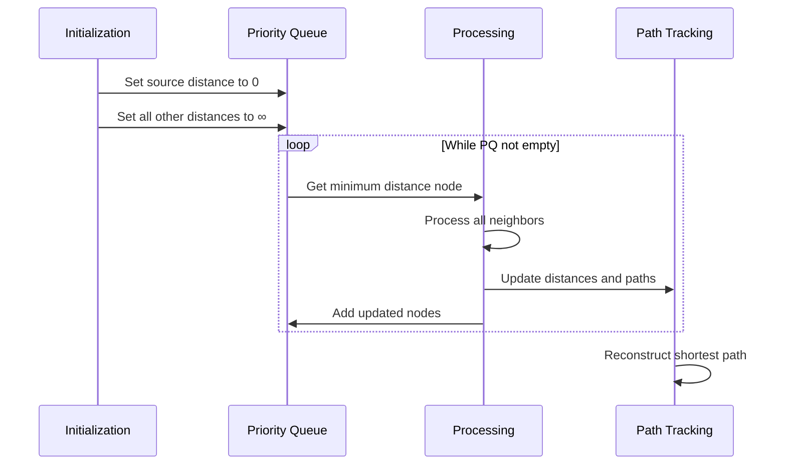
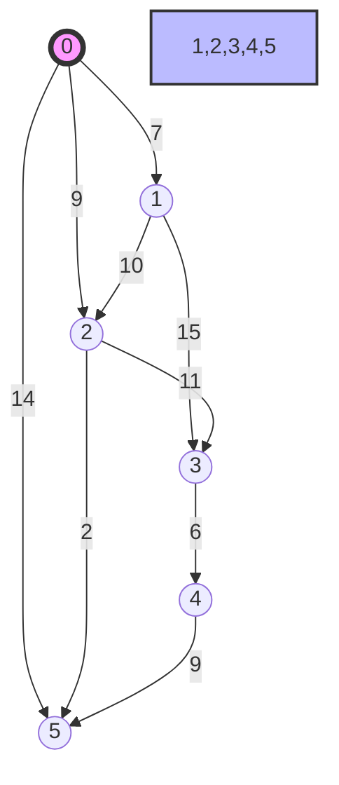
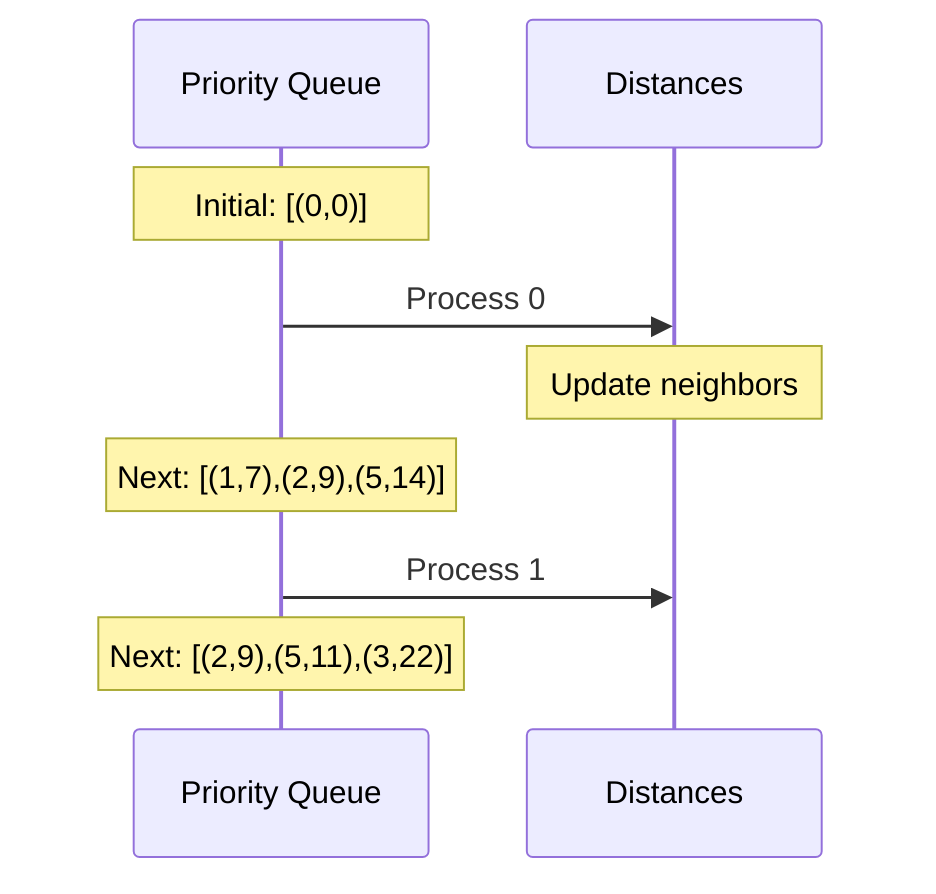
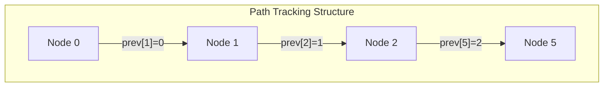
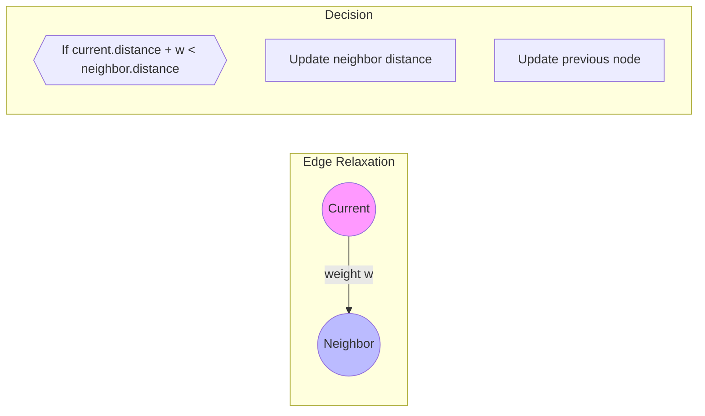

# Comprehensive Guide to Dijkstra's Algorithm Implementation

## 1. Algorithm Overview

Dijkstra's algorithm finds the shortest paths between nodes in a weighted graph, which may represent networks, roads, or any weighted relationships.

### Core Components
```mermaid
graph TD
    subgraph Components
        PQ[Priority Queue] --> |Maintains Order| NP[Node Processing]
        NP --> |Updates| DT[Distance Tracking]
        DT --> |Records| PT[Path Tracking]
        PT --> |Enables| PR[Path Reconstruction]
```

## 2. Implementation Structure

### Base Graph Structure
```java
public class WeightedGraph<T> {
    private Map<T, Map<T, Integer>> adjacencyList;
    
    public void addEdge(T source, T destination, int weight) {
        adjacencyList.computeIfAbsent(source, k -> new HashMap<>())
                    .put(destination, weight);
    }
}
```

### Priority Queue Management
```java
PriorityQueue<Node> pq = new PriorityQueue<>((a, b) -> 
    distances.get(a) - distances.get(b));
```

## 3. Algorithm Execution Process



## 4. Example Walkthrough

### Sample Graph


### Processing Steps
1. Initialize distances:
```
Node 0: 0
All other nodes: ∞
```

2. Priority Queue States:


## 5. Path Reconstruction



### Implementation:
```java
private List<Node> reconstructPath(Node destination) {
    List<Node> path = new ArrayList<>();
    Node current = destination;
    
    while (current != null) {
        path.add(0, current);
        current = previousNodes.get(current);
    }
    return path;
}
```

## 6. Edge Relaxation Process



## 7. Performance Characteristics

### Time Complexity
- With Binary Heap: O((V + E) log V)
- With Fibonacci Heap: O(E + V log V)

### Space Complexity
- Adjacency List: O(V + E)
- Priority Queue: O(V)
- Distance/Previous Arrays: O(V)

## 8. Optimization Techniques

1. **Priority Queue Optimization**
```java
// Use offers instead of updates
if (newDistance < distances.get(neighbor)) {
    pq.offer(new Node(neighbor, newDistance));
    distances.put(neighbor, newDistance);
}
```

2. **Memory Management**
```java
// Use primitive arrays for small graphs
int[] distances = new int[vertices];
int[] previous = new int[vertices];
```

3. **Early Termination**
```java
if (current.equals(destination)) {
    break; // Found shortest path to destination
}
```

## 9. Best Practices

1. Input Validation
```java
public void validateInput(Graph graph) {
    if (graph == null || graph.isEmpty()) {
        throw new IllegalArgumentException("Invalid graph");
    }
}
```

2. Edge Case Handling
```java
if (source.equals(destination)) {
    return Collections.singletonList(source);
}
```

3. Negative Weight Detection
```java
for (Edge edge : graph.getEdges()) {
    if (edge.weight < 0) {
        throw new IllegalArgumentException("Negative weights not supported");
    }
}
```

## 10. Common Applications

1. Network Routing
2. Social Networks
3. Geographic Maps
4. Game AI Pathfinding
5. Resource Distribution

## 11. Testing Strategies

```java
@Test
public void testShortestPath() {
    WeightedGraph graph = new WeightedGraph();
    // Add test edges
    List<Node> path = dijkstra(graph, source, destination);
    assertNotNull(path);
    assertEquals(expectedDistance, getPathDistance(path));
}
```

Would you like me to expand on any particular section or add more specific implementation details?